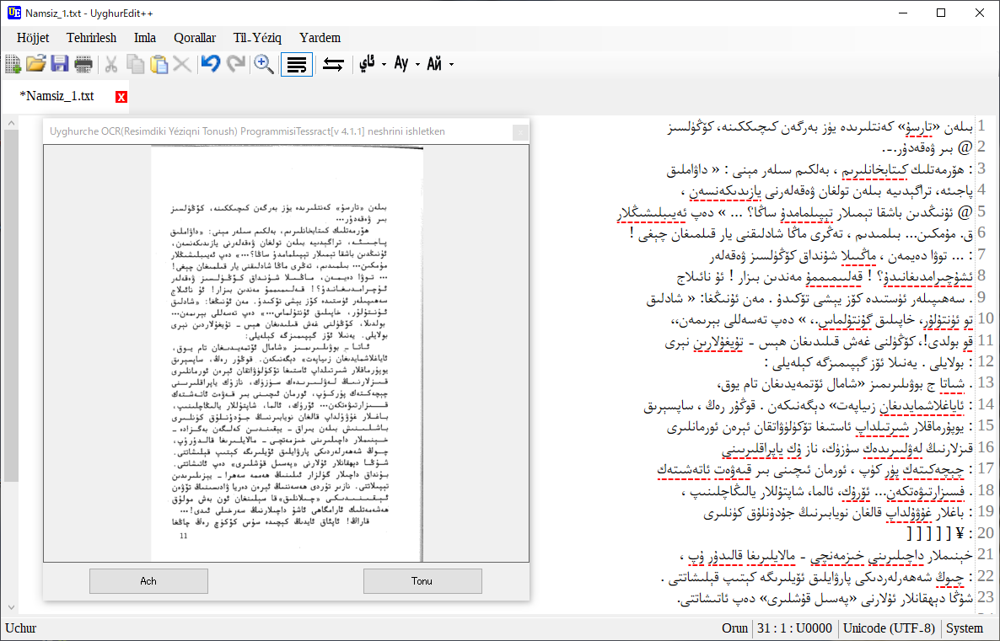

# UyghurEdit++
Text Editor with Spell Check Ability for Uyghur

# UyghurEdit++
Mexsus Uyghurche tehrirlesh üchün tüzülgen, Imla tekshürüsh(Imlasi xata sözlerning astigha qizil siziq bilen dawamliq körsitip bérish), Yéziqlarni almashturush, OCR(Resimdiki tékistlerni tonush) iqtidari bolghan, heqsiz tehrirligüch.
Esli kodini chüshürüp özingiz yughurup(compile) qilip ishletsingizmu yaki https://drive.google.com/drive/folders/0B3OaZ1ZVPcTXVzJ0VnFWeUhGNFE din teyyarni chüshürüp ishletsingizmu bolidu.
64 bitliq Windows üchün yuqiridiki yerdiki UyghurEditPP.zip ni ishliting. 32 bitliq Windows üchün UyghurEditPP32.zip ni ishliting.
Zip ni yéyipla ichidiki UyghurEditPP.exe ni ijra qilsingiz bolidu.

# Addiy Ishlitish Qollanmisi

### Yéziqlarni aylandurush usuli:
Qoral baldaqtiki "ئاي" ni chekse Uyghur Ereb yéziqigha, "Ay" chekse Uyghur latin yéziqigha, "Ай" chekse Uyghur Slawyan yéziqigha aylandurup yéngi bir köznekte netijini körsitidu. Eger melum da’ire tallan’ghan bolsa shu yernila oz jayida aylanduridu.

# Ékran körünüshliri:

  

  

  

  

# Ishlitilgen ochuq kodlar
Avalonedit: https://github.com/icsharpcode/AvalonEdit

DynaJson: https://github.com/fujieda/DynaJson

Tesseract .Net: https://github.com/charlesw/tesseract

SymSpell: https://github.com/wolfgarbe/SymSpell (Hazirche bu ishlitilmidi. emma esli kodi saqlinip qélindi)
