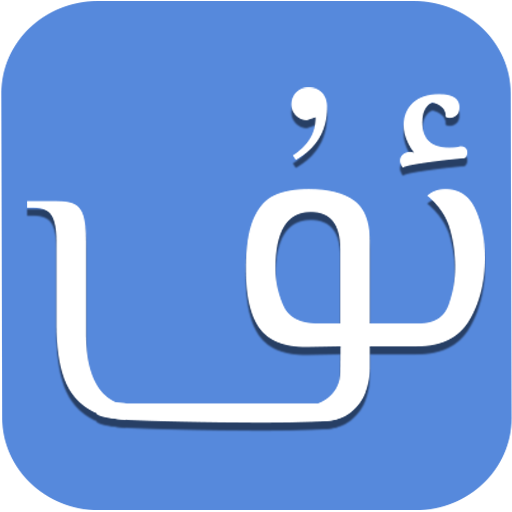
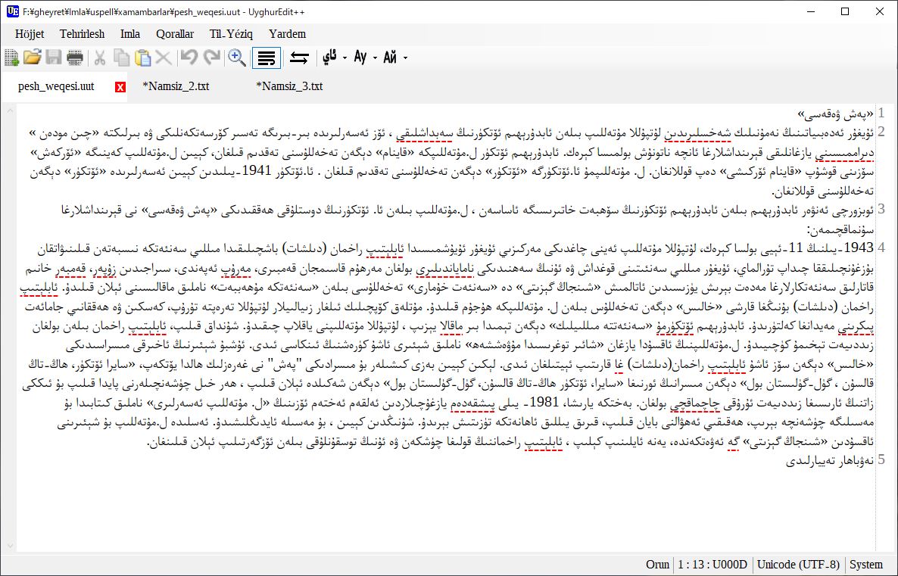
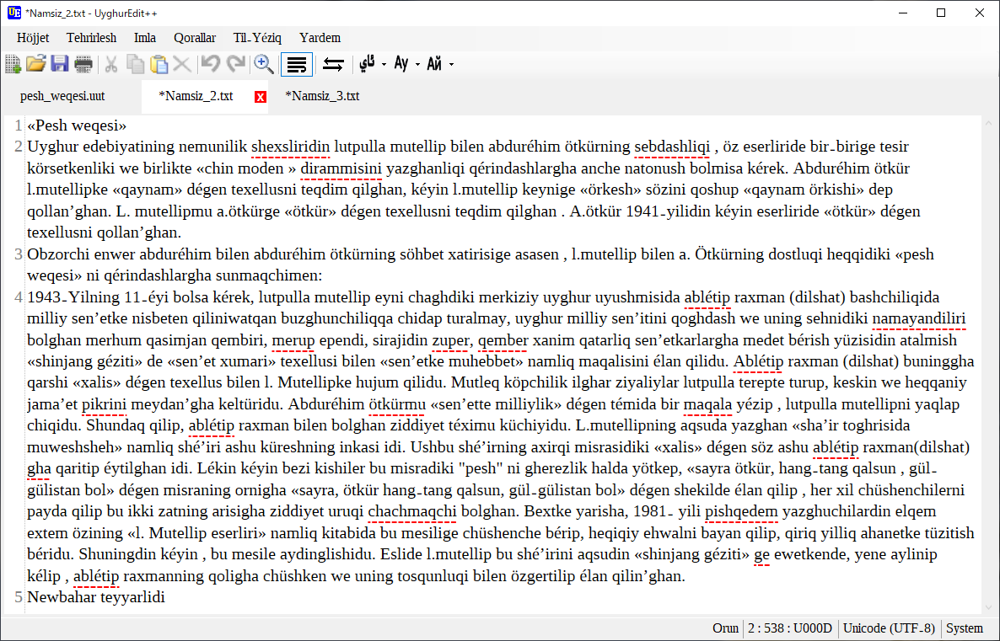
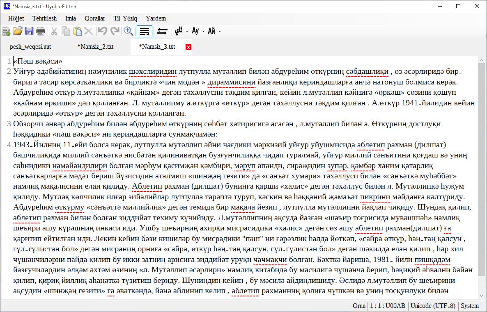
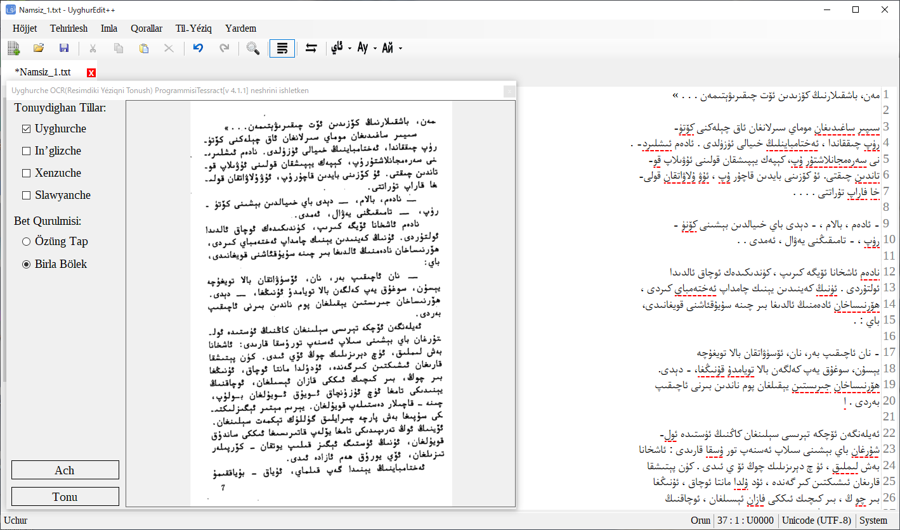

# UyghurEdit++

Text Editor with Spell Check Ability for Uyghur

  

# UyghurEdit++
Mexsus Uyghurche tehrirlesh üchün tüzülgen, Imla tekshürüsh(Imlasi xata sözlerning astigha qizil siziq bilen dawamliq körsitip bérish), Yéziqlarni almashturush, OCR(Resimdiki tékistlerni tonush) iqtidari bolghan, heqsiz tehrirligüch.

Esli kodini chüshürüp özingiz yughurup(compile) qilip ishletsingizmu, https://drive.google.com/drive/folders/0B3OaZ1ZVPcTXVzJ0VnFWeUhGNFE din teyyarni chüshürüp ishletsingizmu bolidu.
64 bitliq Windows üchün yuqiridiki yerdiki UyghurEditPP.zip ni ishliting. 
32 bitliq Windows üchün UyghurEditPP32.zip ni ishliting.

Teyyarsi mushu yergimu qoyuldi(Eng Yéngisi)
### [64 bitliq Windows üchün bu yerni chéking](https://github.com/gheyret/UyghurEditPP/releases/download/0.2/UyghurEditPP.zip)
### [32 bitliq Windows üchün bu yerni chéking](https://github.com/gheyret/UyghurEditPP/releases/download/0.2/UyghurEditPP32.zip)

Zip ni yéyipla ichidiki UyghurEditPP.exe ni ijra qilsingiz bolidu.

### V.03 neshri(2021/03/17)
      * OCR da Uyghurche, In’glizche, Xenzuche yéziqlarni tonush iqtidari qoshuldi. 
        buning bilen arilash yéziqlarni tonush emelge ashuruldi.
      * Bir qisim xataliqlar tüzitildi.
      * Bir qisim körsetme uchurlar tüzitildi.
       
Chüshürüsh:
  [64 bitliq Windows üchün](https://github.com/gheyret/UyghurEditPP/releases/download/0.3/UyghurEditPP.zip)
  
  [32 bitliq Windows üchün](https://github.com/gheyret/UyghurEditPP/releases/download/0.3/UyghurEditPP32.zip)

### V.02 neshri(2021/03/05)
    * UyghurEdit++ ning tughi özgertildi.(lahiyelep bergen qérindishimizgha kop rehmet).
    * Izdesh we Almashturush iqtidari yaxshilandi.
    * Tehrirlewatqan höjjettin HTML yasash iqtidari qoshuldi.

    **Chüshürüsh**
  [64 bitliq Windows üchün](https://github.com/gheyret/UyghurEditPP/releases/download/0.2/UyghurEditPP.zip)
  
  [32 bitliq Windows üchün](https://github.com/gheyret/UyghurEditPP/releases/download/0.2/UyghurEditPP32.zip)
 
[Ishlitish qollanmisi](https://github.com/gheyret/UyghurEditPP/wiki/Addiy-Ishlitish-Qollanmisi)

# Ékran körünüshliri:

  

  

  

  

# Ishlitilgen ochuq kodlar
Avalonedit: https://github.com/icsharpcode/AvalonEdit

DynaJson: https://github.com/fujieda/DynaJson

Tesseract .Net: https://github.com/charlesw/tesseract

SymSpell: https://github.com/wolfgarbe/SymSpell (Hazirche bu ishlitilmidi. emma esli kodi saqlinip qélindi)
